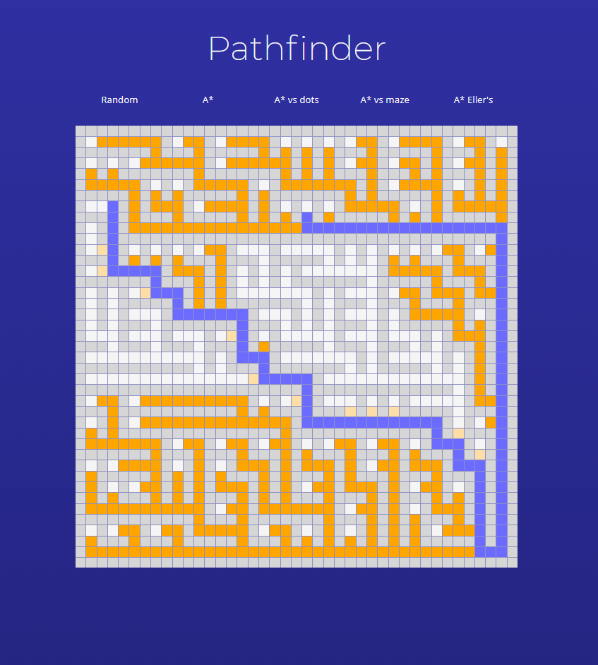

## Pathfinder visualisation tool

### Feature list

- ✅ Grid animation
- ✅ Grid traversal
- ✅ A\* traversal
- ✅ Binary Tree maze
- ✅ Recursive Division maze
- ✅ Dynamic grid UI

### About

Quick visualisation tool, demonstrating some maze generating and pathfinding algorithms in action. Written in vanilla JavaScript as an exercise.

### To Do

- ✓ Dynamic grid size
- Dynamic generation\traversal speeds
- Separate maze generation and pathfinding
- No path handling
- ✓ Slow down maze generation
- ✓ Fragmented map generation (faster loading on large maps)
- More traversal algorithms
- Mazerunner vs Architect
- Dynamic nodes
- Mobile width
- Mobile fullscreen
- Mobile borders - color
- Optimise & Refactor
